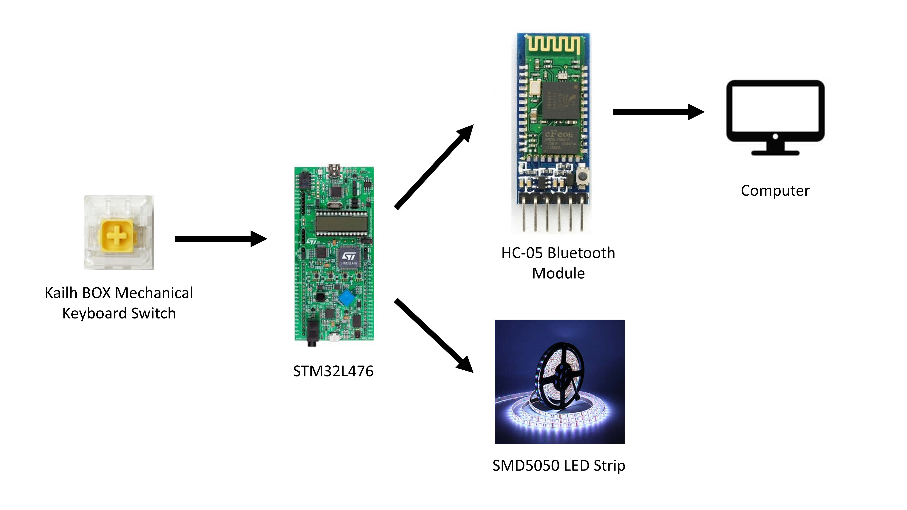

# DDR Pad 

Norman Chung, Andrew Lu.

ECE 153B, Winter 2020, Professor Isukapalli.

[View repository on GitHub](https://github.com/andrewhlu/ddr)

---

## Overview

The goal of this project is to create a dance pad designed to play the “Dance Dance Revolution” game commonly found in arcades. The dance pad will consist of a large 3x3 grid with up, down, left, and right arrows which will serve as large buttons. When playing the game, users can step on the large buttons, which will cause an interrupt to send a keystroke over Bluetooth to the computer running the game. We will also utilize an NFC reader to manage credits like a standard arcade machine, and keep a scoreboard.

## Parts List

| Part | Quantity | Unit Price | Total Price |
|------|----------|------------|-------------|
| [STM32L476 Discovery Board](https://www.digikey.com/short/z871d5) | 1 | $25.00 | $25.00 |
| [HC-05 Bluetooth Module](https://www.amazon.com/dp/B00INWZRNC/) | 1 | $10.90 | $10.90 |
| [NovelKeys x Kailh BOX Heavy Switches, Dark Yellow (Pack of 10)](https://novelkeys.xyz/collections/switches/products/novelkeys-x-kailh-box-heavy-switches) | 2 | $3.00 | $6.00 |
| [Confined-Space Conical Compression Spring, 0.375" Long, 0.6" x 0.281" OD](https://www.mcmaster.com/1692K918) | 20 | $0.98 | $19.60 |
| [PN532 NFC Module](https://www.amazon.com/dp/B01I1J17LC/) | 1 | $9.99 | $9.99 |
| SMD5050 Chipset RGB LED Strip (12V) | 3 | ? | ? |
| [ELECTRONIX EXPRESS Solid Hook Up Wire Kit 22 Gauge](https://www.amazon.com/dp/B00B4ZRPEY/) | 1 | $18.99 | $18.99 |
| [Sanded Plywood (15/32 in. x 4 ft. x 8 ft.)](https://www.homedepot.com/p/100097501) | 1 | $29.45 | $29.45 |
| [1 in. x 2 in. x 8 ft. Furring Strip Board](https://www.homedepot.com/p/100009348) | 1 | $1.18 | $1.18 |
| [12 in. x 24 in. x .093 in. Clear Polycarbonate Sheet](https://www.homedepot.com/p/202038063) | 2 | $15.98 | $31.96 |

\* This parts list shows every part we have ordered (or plan on ordering) so far, including extra quantities that we have ordered for testing and as a backup. This will be updated as the project progresses to reflect the actual parts used. All prices are listed before taxes, tariffs, and shipping costs.

## Peripherals

* 4-8 custom-made button pads
    * The button pad will consist of a large piece of wood or acrylic connected to a mechanical keyboard switch and separated by springs. When the pad is compressed by a user stepping on it, the wood will push the keyboard switch, triggering an interrupt.
* HC-05 Bluetooth Module
    * Used to send keystrokes to a host computer.
    * Communicates with the STM32 board using UART.
* PN532 NFC Reader
    * Reads NFC tags, which will be linked to specific people for keeping track of credits and scores.
    * Communicates with the STM32 board using either I2C or SPI (this module has support for both).
* LED Strips (SMD5050 chipset)
    * Layered on the side of the pads, so when a user steps on it, the strip lights up.
* Wood, Acrylic, and Springs for the assembly of the pad.
* Computer (used to play [StepMania](https://www.stepmania.com/), a rhythm game designed to simulate "Dance Dance Revolution")

## Software Design

* Each of the switches will be connected to a GPIO input pin. When the user steps on the pad, the circuit in the pad will be connected and trigger the interrupt for that GPIO pin. 
* If the interrupt is caused by a rising edge (stepping on the pad), the interrupt handler will send a message to the computer via the HC-05 bluetooth module stating that the pad has been pressed and a keyboard press should be emulated.
* When the user steps off the pad, the interrupt caused by the falling edge will send another message to the computer stating that the pad has been released and the keyboard press should be stopped.
* In addition, when the interrupt is triggered, we will light up the LED strip to full brightness for that pad. When the user steps off, the brightness of that LED strip will gradually dim until it turns off, or if it is stepped on again.
* The NFC module will disable the button pads until a valid NFC tag with credits is presented to the reader, allowing the user to play.

## Block Diagram

NOTE: Due to changes in our project (as described in our Weekly Updates), this block diagram is out of date. We will post an updated version once the project is near completion.

## Goals

* Construct 4-8 button pads capable of withstanding continued footsteps (in a way that will not ruin the springs or the switches in the long run).
* Create an interrupt, triggered on both rising and falling edges, to translate pad steps to keypress messages communicated over Bluetooth to the computer running the game.
* When reading in the rising edge or falling edge, change the state of the LED lights accordingly.
* Store user credits and scores on the STM32 board, or find a way to delegate it elsewhere.
* Make sure the NFC reader works accurately, and add a feature to count credits.
    * Include feature to add credits and subtract upon each game.

## Group Responsibilities

* Andrew will design and assemble the button pads, and find the best materials to use.
* Norman will assist in creating the frame for the button pads, and mount the LEDs.
* When working on software, Andrew will work on implementing NFC functionality, while Norman will work on setting up the GPIO interrupts and Bluetooth functionality.

---

The original project proposal, submitted to GauchoSpace, can be found [here](proposal.pdf).

---

# Weekly Updates

## Week 6 Update

After an initial review by our TA ([Ryan Kirkpatrick](https://www.ece.ucsb.edu/~yoga/capstone/static/img/students/ryan_kirkpatrick.jpg)), along with some additional research about ways to implement our large button pads, we have decided to make the following changes to our project:

* Instead of using foil pads for our large buttons, we will look into using mechanical keyboard switches (specifically [NovelKeys x Kailh BOX Heavy Switches, Dark Yellow](https://novelkeys.xyz/collections/switches/products/novelkeys-x-kailh-box-heavy-switches)), since they have two legs and can be connected like a regular button. 
    * We have purchased two packs and will be testing this with our board once we receive them.
* The NFC functionality for inserting credits will be moved to the end of our project and set as a stretch goal, upon recommendation from Ryan, since I2C communication for the PN532 module has the potential to cause a lot of issues.
    * If time permits, we will try to implement this functionality, but it will be put on the side for now.
* We will initially start with only four large button pads for the four directions. The "Select" and "Back" buttons will either be added in later or simply be smaller buttons on the side.

## Week 7 Update

We have received our initial order of mechanical keyboard switches. We were able to wire them like buttons and successfully use them to trigger interrupts by reading standard GPIO input. 

The switch was connected as follows:

* One leg of the switch is connected to the 3V3 pin on the Discovery board.
* The other leg of the switch is connected via a breadboard to GPIO pin PB2 and one leg of a resistor.
* The other leg of the resistor is connected to GND.

When the switch is pressed, the two legs will be connected, allowing current to flow. The GPIO input pin reads the voltage after the switch and uses its state to trigger an interrupt.

This circuit was tested using the code from Lab 1, Part B. No changes were made to the code, and the circuit works as expected, so we will move forward with using mechanical keyboard switches to detect steps on our DDR pad.

We plan to perform the following tasks this weekend:

* Finish Lab 3 (which will allow us to better understand the operation of the HC-05 Bluetooth Module).
* Create / sketch the design for the DDR pad. This includes the wood base, springs, switch placement, wiring, LEDs, etc.
* Create a list of parts we will need to purchase, and come up with a plan for purchasing these parts.
* Using the code from Lab 1, Part B, as a start, write the code and interrupts for the four switches that will be used.

## Week 8 Update

We started this week by completing Lab 3. In doing so, however, we discovered that the HC-05 Bluetooth Module is unable to act as a HID device. Upon researching this issue, we discovered that it is theoretically possible to flash the firmware on the module to allow the module to act as an HID device ([see this Instructables article](https://www.instructables.com/id/Upgrade-Your-3-Bluetooth-Module-to-Have-HID-Firmwa/)), but doing so would require us to buy an additional breakout board just to flash the new image. We simply didn't have the time to purchase it, so we looked for other options.

As a result, we decided to forego emulating a Bluetooth Keyboard. We will instead use standard UART communication over Bluetooth, like we did with Lab 3. In order to get our pad presses into the StepMania app, we wrote a simple Python script that will read input from the COM port that the HC-05 is connected to, and emulate a keypress using a library such as [pywin32](https://pypi.org/project/pywin32/) or [pyautogui](https://pyautogui.readthedocs.io/en/latest/).

During Wednesday's lab session, we combined parts of Lab 1B and Lab 3A starter code to use one of our mechanical keyboard switches to emulate the keypress of the character "a" on a computer. The code can be found [on GitHub](https://github.com/andrewhlu/ddr/tree/d73674e7bb15bfca19e8809a1d047ec9f7723af4).

We have also started to plan the design and come up with a list of materials that we need. [This image](week-8-planning.png) shows the preliminary sketches we made during Wednesday's lab session for the design of the pad. We agreed to purchase the springs from McMaster-Carr and purchase the rest of the components from Home Depot. The exact list of components will be decided over the weekend, when we can create a more exact design.
